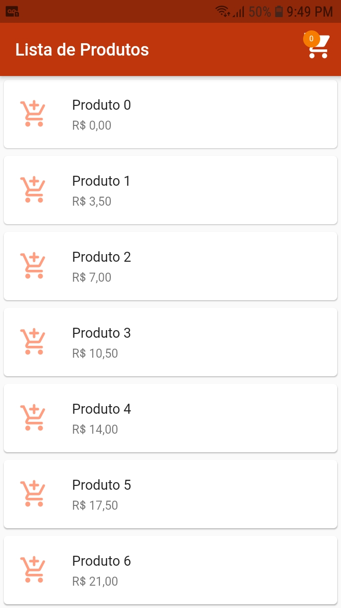
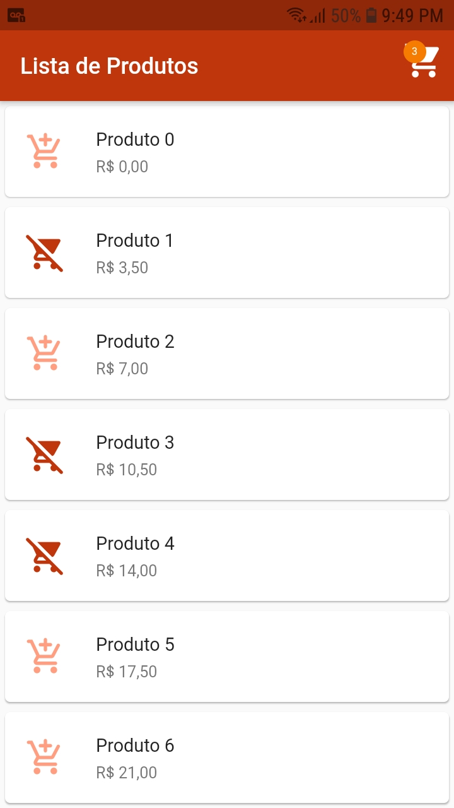
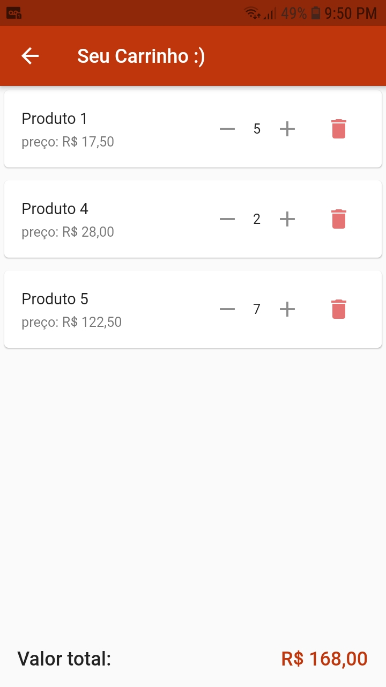

# LevelUP#5

O desafio da semana como combinado em sala de aula, foi dar seguimento no
desenvolvimento de um carrinho  de compras utilizando de gerência de estado, como
vimos na aula do dia 20/07, o MobX!

## Features

Nesse desafio esperamos ter as seguintes telas e funcionalidades :

- Listagem de produtos
- Carrinho de compras
- Adicionar itens ao carrinho
- Atualizar o componente de contador de itens do carrinho sem atualizar a tela completa

## Resultado

    
    

    
    

## Packages Utilizados

- mobx: ^2.0.1
- flutter_mobx: ^2.0.0
- build_runner: ^2.0.6
- mobx_codegen: ^2.0.1+3
